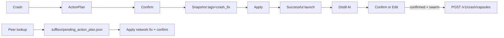
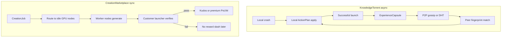

# 13. TuffSwarm — федеративная сеть TuffBox

> **Канон для людей и ИИ-агентов.** Перед любой работой по P2P / federated learning / marketplace задач прочитай этот файл и [`06-ai-role.md`](06-ai-role.md).

**Статус:** архитектура + **MVP flywheel** + **Supabase-first remote** (signed ExperienceCapsule publish/lookup) + Phase B HTTP hub (optional fallback) + **Phase C P2P scaffold** (`tuffswarm-node`; не удалять). Foundation: ActionPlan, Crash KB, remote client, swarm opt-in gate, **Resolution Distill → Confirm → capsule**, pending network plan, local co-occurrence → Creation trends.

## Locked decisions (expert 2026-07)

| Тема | Решение |
|------|---------|
| Start transport | **Supabase** (Edge Function write + PostgREST read); P2P остаётся opt-in Phase C, код **не удалять** |
| Transport pattern (P2P) | **Sidecar** `tuffswarm-node` + local control HTTP (`127.0.0.1`) + bearer token; не вшивать libp2p в UI-процесс |
| Knowledge exchange | Целые **ExperienceCapsule** (JSON); content-hash + Ed25519 soft-sign (device key) |
| Soft verify | Human-in-the-loop: confirm → snapshot → apply → successful launch = reward signal; library `success_count` ranking |
| Anti-spam ingest | Edge Function: schema + hash + Ed25519 verify + rate-limit by `signerPublicKey`; RLS: anon SELECT only, no direct INSERT |
| Publish gate | **MUST NOT** auto-upload solutions. Post-resolution **Distill** → human Confirm/Edit → then `ExperienceCapsule` |
| Secrets | Anon key OK in client/keyring; **service role NEVER in binary** |
| Tensor / Tenso / gRPC | **Отложено** на Stage 16+ (только если появится pipeline-parallel inference) |
| Creation Marketplace | Prior art = **AI Horde** (целая задача воркеру + Kudos без on-chain); **не** Petals/pipeline LLM — Phase **D** |
| Не делаем сейчас | Pipeline/tensor parallelism, PoUW/Yuma/blockchain DePIN, RepOps/Verde bit-exact, auto-apply без confirm, auto-publish без Confirm |

## Executive summary

**TuffSwarm** — двухконтурная сеть узлов TuffBox (лаунчеров / IDE):

| Контур | Имя | Характер | Ценность |
|--------|-----|----------|----------|
| 1 | **Knowledge Torrent** | Асинхронный обмен опытом крашей | Самообучение сети: чужой успешный фикс лечит мой краш |
| 2 | **Creation Marketplace** | Синхронные задачи за награду | Генерация сборок / KubeJS / рецептов на простаивающих GPU |

Это Federated Learning + Collaborative RL, адаптированные под Minecraft modpack niche.

Эффект маховика (**data flywheel**): игроки — лучшие верификаторы. Успешный launch после плана = implicit positive reward; сеть закрепляет паттерн.

## Shared capsule network (solutions survive)

Clients **do not** upload raw `crash-report` / `latest.log` by default. They exchange **ExperienceCapsule**:

- fingerprint (exception / frames / mc / loader)
- `solution` text
- executable `actions[]` (ActionPlan ops)
- success counters

### Durable layers

| Layer | Where | Who sees it |
|-------|--------|-------------|
| Global local library | `%APPDATA%/TuffBox/swarm/capsules.jsonl` (or OS config dir) | All projects on this PC |
| Device signing key | `%APPDATA%/TuffBox/swarm/device_signing_key` | Local only (Ed25519 soft-sign) |
| Project authored export | `.tuffbox/crash_kb/export/` | Pack author |
| **Supabase** (preferred start) | `experience_capsules` table + `publish-capsule` Edge Function | All clients with project URL + anon key |
| **TuffSwarm hub** (optional) | `tuffswarm-hub` JSONL store | Clients with hub URL |

### Deploy Supabase (community inbox)

1. Create a Supabase project.
2. Apply migration: [`supabase/migrations/001_experience_capsules.sql`](../supabase/migrations/001_experience_capsules.sql)
3. Deploy function: `supabase functions deploy publish-capsule` (see [`supabase/functions/publish-capsule`](../supabase/functions/publish-capsule))
4. In TuffBox Settings → **TuffSwarm**: enable the network. Community URL + publishable key are **built into the client** (no user setup). Optional Advanced override for self-hosted Supabase.

Ingest policy (Edge Function):

- Require `contentHash` + Ed25519 `signature` / `signerPublicKey`
- Recompute canonical hash (`fingerprint.key \\n solution \\n actionsJson`) — must match
- Reject raw logs / notes / unknown `op`
- Rate-limit by signer (default 30/hour)
- RLS: anon may **SELECT** only; **no** direct INSERT (service role inside function only)

**Honesty:** signature proves device-key attribution + payload integrity, not that a real crash happened. Soft-verify Confirm remains a client gate.

### Run a hub for your team / community (optional fallback)

```bash
cargo run -p tuffswarm-hub -- --bind 0.0.0.0:8787
```

In TuffBox Settings → **TuffSwarm** → set **Swarm hub URL** (optional) and enable the network.

Flow:

1. User A hits a crash and fixes it (any path — may be inefficient).
2. Soft-verify: successful relaunch → resolution recorded in History.
3. **Resolution Distill** (auto, beta): local AI analyzes action history → minimal `ActionPlan`.
4. UI shows the plan → user **Confirm** (or **Edit** then Confirm) → only then signed `ExperienceCapsule` → global library + **Supabase** (and optional hub/P2P).
5. User B hits a similar crash → **AI Explain** may **read** network (lookup) → pending ActionPlan → confirm apply.

**MUST NOT** auto-apply. **MUST NOT** publish during AI Explain. **MUST** strip notes / raw logs on publish (hub/Edge Function reject payloads with raw logs).

### AI Explain vs Resolution Distill

| Mechanism | When | Network | Purpose |
|-----------|------|---------|---------|
| **AI Explain** | Diagnostics button | **Read** (lookup/diagnose) | Diagnose current crash using local history + optional peer capsules |
| **Resolution Distill** | Auto after verified fix | **Write** only after Confirm | Compress user's fix path into an efficient plan for peers |

Explain **MUST NOT** persist remote hits into the durable capsule library. Distill **MUST NOT** publish until the user confirms (or edits) the proposed plan.

### Opt-in gate (зафиксировано)

При первом запуске (нет `swarm.onboardingDone` в `integrations.json`):

> Использовать сеть TuffSwarm?  
> Обмен опытом крашей и Creation mode (тренды сборок). Без сети эти режимы недоступны.

| Поле | Смысл |
|------|--------|
| `swarm.enabled` | Master switch |
| `swarm.onboardingDone` | Wizard уже показан |
| `swarm.sharePromptsEnabled` | Диалог distill → Confirm после verified relaunch (default `true`) |

Settings: переключатель **Use TuffSwarm network** всегда доступен.

| Когда `enabled == false` | Поведение |
|--------------------------|-----------|
| **Network Fix Mode** | Нет remote lookup/diagnose, share capsule, pending network plan, Apply network fix |
| **Creation Mode** | Нет co-occurrence upload/trends / Create-from-trends |
| **Остаётся** | Локальный Crash Assistant, ручные фиксы, обычный Modrinth, snapshots/history |

Backend **MUST** проверять флаг (не только UI).

## Crash→Fix flywheel (MVP, Phase B)



1. **Snapshots / History** — meta: `tags: ["crash_fix"]`, `crashFingerprintKey`, `planSource` (`ai|kb|swarm|manual|distill`), `matchedCaseIds`. UI badges.
2. **Distill after success** — если swarm on + share prompts: auto distill from user action timeline → review UI → Confirm/Edit → signed `ExperienceCapsule` → Supabase `publish-capsule` (else optional hub `POST /v1/crash/capsules` / local only).
3. **Peer pending plan** — сильный network/KB match → `.tuffbox/pending_action_plan.json` → Diagnostics **Apply network fix** (confirm обязателен; **MUST NOT** auto-apply).
4. **Creation co-occurrence** — локальные пары модов + optional hub `POST /v1/mods/cooccurrence`; Library → Create → preview → confirm → Modrinth install.

### Remote transports (start = Supabase)

| Transport | Write | Read | Notes |
|-----------|-------|------|-------|
| **Supabase** | `POST /functions/v1/publish-capsule` | `GET /rest/v1/experience_capsules?fingerprint_key=eq.…` | **Built-in** community project; optional Settings override |
| HTTP hub | `POST /v1/crash/capsules` | `POST /v1/crash/lookup` (+ diagnose) | Optional self-host / team |
| P2P node | control HTTP publish | control HTTP lookup | Phase C opt-in; code kept |

### HTTP hub endpoints (Phase B fallback)

| Method | Path | Назначение |
|--------|------|------------|
| POST | `/v1/crash/lookup` | Top-N hits for local RAG |
| POST | `/v1/crash/diagnose` | Server ActionPlan |
| POST | `/v1/crash/capsules` | Publish ExperienceCapsule |
| POST | `/v1/mods/cooccurrence` | Network pair stats (opt-in) |

**Transport MVP:** Supabase-first; hub HTTP (`crash_remote`) and P2P remain available.



## Relation to current TuffBox

Локальный контур **MUST** оставаться источником истины для применения фиксов:

| Уже есть | Роль в TuffSwarm |
|----------|------------------|
| Fingerprint + authored cases ([`crash_kb.rs`](../crates/tuffbox-core/src/crash_kb.rs)) | Сырьё для `ExperienceCapsule` |
| `ActionPlan` / `LauncherAction` ([`action_plan.rs`](../crates/tuffbox-core/src/action_plan.rs)) | Единый executable контракт на всех узлах |
| Dual-mode diagnose + `crash_remote` ([`crash_remote.rs`](../crates/tuffbox-core/src/crash_remote.rs), [`06-ai-role.md`](06-ai-role.md)) | Phase B: централизованный / opt-in remote KB |
| Snapshot + confirm + deterministic apply | Hard gate: сеть предлагает, клиент применяет |

**MUST NOT:** сеть сама молча меняет файлы на чужой машине.  
**MUST:** любой сетевой план проходит `validate_action_plan` → UI confirm → snapshot → apply (как локальный AI).

## Mode 1: Knowledge Torrent (торрент знаний)

### Поток на устройстве

1. Краш → local parser / Crash Assistant / **AI Explain** → `ActionPlan`.
2. Пользователь подтверждает → snapshot → apply.
3. Успешный запуск Minecraft → **positive signal** (implicit reward) + resolution в History.
4. **Resolution Distill** (auto, beta): ИИ сжимает историю действий в минимальный план → UI Confirm/Edit.
5. Только после Confirm узел публикует **ExperienceCapsule** (opt-in), не raw crash-log.

Аналогия: on-device обучение ассистента (как идеи CodeAssist / Gensyn) — локальный опыт; в сеть уходит сжатый опыт.

### Что обмениваем

**MUST** обменивать:

- fingerprint key / exception / top frames / mc / loader;
- `solution` (короткий текст);
- `actions[]` в формате ActionPlan `op`;
- `successScore` / counters;
- опционально позже: ссылка на lightweight adapter (LoRA) для класса крашей.

**MUST NOT** обменивать по умолчанию:

- полные crash-reports / latest.log;
- author `notes`;
- весь корпус private KB;
- пути к миру / персональные файлы.

Research references (не обязательства реализации): SAPO / RL Swarm (обмен rollouts / малыми обновлениями), Petals-style adapter hub, DHT lookup по fingerprint.

### Torrent-hub адаптеров (Phase E)

Узлы могут обучать маленькие адаптеры под семейства крашей (mixin, NoClassDef, Create addon, …) и публиковать в DHT / репозиторий. Peer с похожим fingerprint скачивает адаптер + capsule, не полный вес базовой модели.

## Mode 2: Creation Marketplace (режим создания)

Когда пользователь хочет собрать сложную сборку / KubeJS / баланс рецептов с нуля, он публикует **CreationJob**.

1. **Маршрутизация:** задача дробится (руды / магия / квесты / конфиги); пайплайн ищет idle GPU с низким пингом.
2. **PoUW (Proof of Useful Work):** воркер получает награду только после верификации.
3. **Верификатор:** лаунчер заказчика — hard verifier: синтаксис JSON/скриптов, опционально headless / test launch. Краш из-за мусора → нет награды (позже: slash стейка).
4. **Anti reward-hacking:** hybrid verify (локальные проверки + ensemble / HERO-style), не доверять самооценке воркера.

Экономика MVP: **Kudos / premium-функции лаунчера**. On-chain токены — поздний опциональный слой, не обязательный для архитектуры.

## Protocols & data shapes

### ExperienceCapsule (Knowledge Torrent)

Производная от authored export (см. Save KB case → `.tuffbox/crash_kb/export/`).

```json
{
  "schemaVersion": 1,
  "id": "capsule-mixin-create-flywheel",
  "fingerprint": {
    "exception": "MixinTransformerError",
    "frames": ["..."],
    "modFile": null,
    "mcMajor": "1.20",
    "loader": "fabric",
    "key": "..."
  },
  "solution": "Align Create + Flywheel versions.",
  "actions": [
    {
      "op": "update_mod",
      "modId": "create",
      "version": null,
      "reason": "Latest compatible",
      "risk": "medium"
    }
  ],
  "successScore": 0.92,
  "successCount": 14,
  "failCount": 1,
  "adapterRef": null,
  "kbVersion": "2026-07-22",
  "privacy": { "rawLogs": false, "notesIncluded": false }
}
```

**MUST:** `notesIncluded: false`.  
**MUST:** `actions` валидны по `KNOWN_OPS` из ActionPlan.

### CreationJob

```json
{
  "schemaVersion": 1,
  "jobId": "job-...",
  "kind": "kubejs_ore_gen" | "quest_scripts" | "recipe_balance" | "mod_configs" | "full_pack_scaffold",
  "constraints": {
    "mcVersion": "1.20.1",
    "loader": "fabric",
    "modIds": ["create", "kubejs"]
  },
  "brief": "Generate overworld ore density scripts compatible with Create.",
  "reward": { "kind": "kudos", "amount": 50 },
  "verify": { "syntax": true, "testLaunch": false }
}
```

### CreationResult

```json
{
  "jobId": "job-...",
  "workerNodeId": "node-...",
  "artifacts": [
    { "path": "kubejs/server_scripts/ores.js", "content": "..." }
  ],
  "claimedConfidence": 0.7
}
```

### VerificationReport

```json
{
  "jobId": "job-...",
  "passed": false,
  "checks": [
    { "name": "syntax", "ok": false, "detail": "Unexpected token line 12" }
  ],
  "rewardGranted": false
}
```

## Vision checklist ↔ Phase (gap)

Сводка требований «полного» Stage 16 vs то, что есть в репозитории. Research names (Tenso, Petals, AsyncMesh, RepOps, Verde) — **ориентиры**, не vendor lock.

### 1. Сетевой слой и транспорт

| Требование | Статус | Phase |
|------------|--------|-------|
| Фоновый P2P-процесс рядом с лаунчером | Scaffold: [`tuffswarm-node`](../crates/tuffswarm-node) | **C** |
| Tenso поверх gRPC / zero-copy → GPU | **Нет** | Future (tensor path) |
| DHT Kademlia (discovery без обязательного центра) | Scaffold в `tuffswarm-node` | **C** |
| Профилирование VRAM / bandwidth / ping → DHT | Stub capability record (`vramMb`, `rttMs`) | **C** → refine later |
| HTTP hub (командный / bootstrap) | **Да** — [`tuffswarm-hub`](../crates/tuffswarm-hub) | **B** (fallback) |
| Supabase capsule store + Edge ingest | **Да** — [`supabase/`](../supabase) + [`swarm_supabase.rs`](../crates/tuffbox-core/src/swarm_supabase.rs) | **B+** (start) |

### 2. Режим «Создания» (distributed inference)

| Требование | Статус | Phase |
|------------|--------|-------|
| Pipeline Parallelism / split LLM layers | **Нет** | D+ |
| Parallax placement + latency DAG | **Нет** | D+ |
| Churn / Petals intermediate cache | **Нет** | D+ |
| Creation co-occurrence → Modrinth | **Да** (локально / hub) | **B** |

### 3. «Торрент знаний» (crash solutions)

| Требование | Статус | Phase |
|------------|--------|-------|
| ExperienceCapsule (без full weights / raw logs) | **Да** | **A/B** |
| Durable store + lookup | **Да** (local library + Supabase + hub + P2P gossip) | **B+/C** |
| Soft-sign (device Ed25519) + Edge verify | **Да** | **B+** |
| Peer confirm/reject + open→saved/rejected (auth required) | **Да** (`vote-capsule` JWT + Crash Votes login) | **B+** |
| Gossip соседям | Scaffold Gossipsub | **C** |
| AsyncMesh / NoLoCo / LoRA micro-updates | **Нет** | **E** |

### 4. Честность и награды

| Требование | Статус | Phase |
|------------|--------|-------|
| Soft verify (confirm + snapshot + launch signal) | **Да** | **A/B** |
| RepOps / Verde / TAO / Kudos PoUW | **Нет** | **F** |

### 5. Sidecar inference (vLLM/MLX ≤1–2 GB)

| Требование | Статус | Phase |
|------------|--------|-------|
| Quantized inference daemon | **Нет** | D+ (не C) |

**Phase C non-goals:** Tenso, gRPC tensor streaming, layer placement, LoRA training, RepOps/Verde, on-chain Kudos.

### Relay / NAT (Phase C harden)

Desktop nodes usually sit behind NAT. `tuffswarm-node` enables **AutoNAT** + **Circuit Relay v2 client** (+ DCUtR when available). A host with a public IP can run the same binary with `--relay-server` and publish its multiaddr as `--bootstrap` for peers.

Control HTTP: `/health` is open for probes; `/v1/*` requires `Authorization: Bearer <token>` (desktop spawns node with an ephemeral token).

## Privacy & trust

| Правило | |
|---------|--|
| Opt-in | Участие в TuffSwarm **MUST** быть явным |
| No corpus dump | Нет endpoint / протокола «скачать всю KB» |
| Notes stay local | Author notes **MUST NOT** попадать в capsule / DHT |
| Fingerprint scrub | Перед ключом: пути → `%USER_HOME%`, UUID → `%UUID%`; line numbers уже снимаются |
| Rate limits | Gossip и job intake ограничены |
| Stake / slash | Только Phase D+; не блокирует MVP Kudos |
| Trust UI | Пользователь видит источник плана: `local` / `remote_kb` / `swarm_capsule` |

## Non-goals / anti-confusion

- TuffSwarm **не** dependency resolver. Resolver остаётся детерминированным в `tuffbox-core`.
- ИИ / сеть **не** применяют фиксы без confirm + snapshot ([`06-ai-role.md`](06-ai-role.md)).
- **AI Explain ≠ Resolution Distill**: Explain читает сеть для диагностики; Distill пишет капсулу только после human Confirm/Edit.
- Private authored KB автора модпака **не** шипится в бинарник игрокам (см. crash KB privacy).
- Knowledge Torrent ≠ Creation Marketplace: разный transport, SLA и экономика.
- Research names (Petals, Bittensor Yuma, SAPO, NoLoCo, HERO) — **ориентиры**, не vendor lock и не обязательный стек.

## Phased roadmap

| Phase | Что | Статус |
|-------|-----|--------|
| **A** | Local ActionPlan + authored export + dual-mode diagnose | В продукте / foundation |
| **B** | Opt-in swarm gate + **tuffswarm-hub** + durable capsules + pending plan + co-occurrence | Client + hub binary in repo |
| **B+** | **Supabase-first** capsule publish/lookup (Edge verify + RLS read); device Ed25519 soft-sign; P2P/hub kept | In product path |
| **C** | P2P ExperienceCapsule gossip / DHT (`tuffswarm-node`) + desktop spawn/bridge + HTTP hub fallback; AutoNAT/Relay client; signed content-hash capsules; control bearer token | Scaffold + harden (opt-in) |
| **D** | Creation Marketplace (AI Horde–style whole jobs + off-chain Kudos) + customer verifier | Future (Stage 16) |
| **E** | Lightweight adapters / federated weight updates | Future |
| **F** | RepOps / Verde / TAO-style verification | Future |

Связь с roadmap: [`07-development-roadmap.md`](07-development-roadmap.md) → Stage 16.

## Agent checklist

Перед кодом, связанным с сетью, агент **MUST**:

1. Прочитать этот файл целиком.
2. Прочитать [`06-ai-role.md`](06-ai-role.md) (ActionPlan contract, dual-mode).
3. Не дублировать словарь действий — только `op` из ActionPlan.
4. Не предлагать отправку raw logs без явного opt-in в спецификации.
5. Любой apply-path: validate → confirm → snapshot → deterministic apply.
6. Publish-path: verified launch → Distill → Confirm/Edit → capsule (**MUST NOT** publish during Explain).
7. Отличать **Supabase (B+ start)** / Phase B HTTP hub / Phase C P2P — разные transports; P2P код не удалять.
8. Publish в Supabase: signed capsule only; service role только на Edge Function.
9. Обновлять этот документ при смене инвариантов; не держать параллельную «тайную» архитектуру только в чате.

## Связанные файлы кода

```text
crates/tuffbox-core/src/action_plan.rs   # executable plan + DISTILL_SYSTEM_PROMPT
crates/tuffbox-core/src/ai_explanation.rs # Explain + DistillContext prompts
crates/tuffbox-core/src/crash_kb.rs      # fingerprint, authored cases, export
crates/tuffbox-core/src/crash_remote.rs  # Phase B hub client (lookup/diagnose/capsules/cooccurrence)
crates/tuffbox-core/src/swarm.rs         # capsule library, device key, pending plan, co-occurrence
crates/tuffbox-core/src/swarm_supabase.rs # Supabase publish + lookup
supabase/migrations/                     # experience_capsules + RLS
supabase/functions/publish-capsule/      # signed ingest Edge Function
crates/tuffswarm-hub/                    # Phase B HTTP hub (optional fallback)
crates/tuffswarm-node/                   # Phase C P2P node (kept; opt-in)
apps/tuffbox-desktop/.../swarm_api.rs    # distill, publish, resolution confirm
apps/tuffbox-desktop/.../integrations.rs # swarm.enabled / supabaseUrl / hubUrl / p2p
apps/tuffbox-desktop/.../ShareCapsuleDialog.svelte  # distill review → Confirm/Edit
apps/tuffbox-desktop/.../CrashVotes.svelte          # community vote board (trust tiles)
apps/tuffbox-desktop/.../Diagnostics.svelte
apps/tuffbox-desktop/.../CreationTrends.svelte
docs/06-ai-role.md
docs/07-development-roadmap.md           # Stage 16
```
