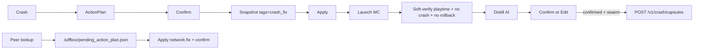
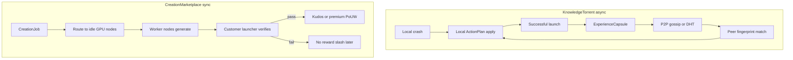

# 13. TuffSwarm — федеративная сеть TuffBox

> **Канон для людей и ИИ-агентов.** Перед любой работой по P2P / federated learning / marketplace задач прочитай этот файл и [`06-ai-role.md`](06-ai-role.md).

**Статус:** архитектура + **MVP flywheel** + **Supabase-first remote** (signed ExperienceCapsule publish/lookup) + Phase B HTTP hub (optional fallback) + **Phase C P2P scaffold** (`tuffswarm-node`; не удалять). Foundation: ActionPlan, Crash KB, remote client, swarm opt-in gate, **Resolution Distill → Confirm → capsule**, pending network plan, local co-occurrence → Creation trends.

## Locked decisions (expert 2026-07)

| Тема | Решение |
|------|---------|
| Start transport | **Supabase** (Edge Function write + PostgREST read); P2P остаётся opt-in Phase C, код **не удалять** |
| Transport pattern (P2P) | **Sidecar** `tuffswarm-node` + local control HTTP (`127.0.0.1`) + bearer token; не вшивать libp2p в UI-процесс |
| Knowledge exchange | Целые **ExperienceCapsule** (JSON); content-hash + Ed25519 soft-sign (device key) |
| Soft verify | Human-in-the-loop: confirm → snapshot → apply → **soft-verify** (healthy log + ~3 min stable / no rollback) = reward signal; library ranking uses weighted trust |
| Anti-spam ingest | Edge Function: schema + hash + Ed25519 verify + rate-limit by `signerPublicKey`; RLS: anon SELECT only, no direct INSERT |
| Publish gate | **MUST NOT** auto-upload solutions. Post-resolution **Distill** → human Confirm/Edit → then `ExperienceCapsule` |
| Secrets | Anon key OK in client/keyring; **service role NEVER in binary** |
| Tensor / Tenso / gRPC | **Отложено** на Stage 16+ (только если появится pipeline-parallel inference) |
| Creation Marketplace | Prior art = **AI Horde** (целая задача воркеру + Kudos без on-chain); **не** Petals/pipeline LLM — Phase **D** |
| Hot co-occurrence | Pair tables (`mod_cooccurrence_pairs`, `mpi_mod_cooccurrence_pairs`) = **source of truth** for incremental bumps |
| Hot read path | Precomputed **top-20** JSONB in `mod_partner_tops`; RPC `partners_for_mod` / `_mpi` reads cache (live fallback on miss) |
| Analytics Buckets / Iceberg | **Отложено** — сырой history не выносим, пока pair tables не упрутся в размер/стоимость |
| Capsule PK | `content_hash` (= fingerprint.key + solution + actionsJson). **Не** SHA сырого краш-лога (multi-solution + soft-sign) |
| Capsule lookup | По `fingerprint_key` (+ ranking); ActionPlan в `actions` / `payload` JSONB |
| Не делаем сейчас | Pipeline/tensor parallelism, PoUW/Yuma/blockchain DePIN, RepOps/Verde bit-exact, auto-apply без confirm, auto-publish без Confirm, Analytics Buckets |

## Executive summary

**TuffSwarm** — двухконтурная сеть узлов TuffBox (лаунчеров / IDE):

| Контур | Имя | Характер | Ценность |
|--------|-----|----------|----------|
| 1 | **Knowledge Torrent** | Асинхронный обмен опытом крашей | Самообучение сети: чужой успешный фикс лечит мой краш |
| 2 | **Creation Marketplace** | Синхронные задачи за награду | Генерация сборок / KubeJS / рецептов на простаивающих GPU |

Это Federated Learning + Collaborative RL, адаптированные под Minecraft modpack niche.

Эффект маховика (**data flywheel**): игроки — лучшие верификаторы. Успешный launch после плана = implicit positive reward; сеть закрепляет паттерн.

## Shared capsule network (solutions survive)

Clients **do not** upload raw `crash-report` / `latest.log` by default. They exchange **ExperienceCapsule**:

- fingerprint (exception / frames / mc / loader)
- `solution` text
- executable `actions[]` (ActionPlan ops)
- success counters

### Durable layers

| Layer | Where | Who sees it |
|-------|--------|-------------|
| Global local library | `%APPDATA%/TuffBox/swarm/capsules.jsonl` (or OS config dir) | All projects on this PC |
| Device signing key | `%APPDATA%/TuffBox/swarm/device_signing_key` | Local only (Ed25519 soft-sign) |
| Project authored export | `.tuffbox/crash_kb/export/` | Pack author |
| **Supabase** (preferred start) | `experience_capsules` table + `publish-capsule` Edge Function | All clients with project URL + anon key |
| **Supabase partner cache** | `mod_partner_tops` (top-20 JSONB per mod); refreshed after MPI hub sync | Create Mode / suggest partners via RPC |
| **TuffSwarm hub** (optional) | `tuffswarm-hub` JSONL store | Clients with hub URL |

### Deploy Supabase (community inbox)

1. Create a Supabase project.
2. Apply migration: [`supabase/migrations/001_experience_capsules.sql`](../supabase/migrations/001_experience_capsules.sql)
3. Deploy function: `supabase functions deploy publish-capsule` (see [`supabase/functions/publish-capsule`](../supabase/functions/publish-capsule)). Edge `@noble/ed25519@2.x` **MUST** wire `@noble/hashes` SHA-512 (`etc.sha512Sync` / `sha512Async`) or verify crashes with `EDGE_FUNCTION_ERROR`. Distill → Confirm → signed capsule → this Edge is the live author path for Kudos.
4. In TuffBox Settings → **TuffSwarm**: enable the network. Community URL + publishable key are **built into the client** (no user setup). Optional Advanced override for self-hosted Supabase.
5. **Crash Votes Auth redirects:** Site URL must not stay on `http://localhost:3000` for end users. In Supabase → Authentication → URL Configuration:
   - Site URL: the confirm landing page [`docs/auth-confirmed.html`](auth-confirmed.html) (e.g. jsDelivr `https://cdn.jsdelivr.net/gh/MFcrychelt/tuffbox@master/docs/auth-confirmed.html`) or your own HTTPS page
   - Redirect URLs: add that same URL
   - Desktop signup passes `emailRedirectTo` to this page so mail clients (Zen, etc.) do not open a dead localhost server

Ingest policy (Edge Function):

- Require `contentHash` + Ed25519 `signature` / `signerPublicKey`
- Recompute canonical hash (`fingerprint.key \\n solution \\n actionsJson`) — must match
- Reject raw logs / notes / unknown `op`
- Rate-limit by signer (default 30/hour)
- RLS: anon may **SELECT** only; **no** direct INSERT (service role inside function only)

**Honesty:** signature proves device-key attribution + payload integrity, not that a real crash happened. Soft-verify Confirm remains a client gate.

### Run a hub for your team / community (optional fallback)

```bash
cargo run -p tuffswarm-hub -- --bind 0.0.0.0:8787
```

In TuffBox Settings → **TuffSwarm** → set **Swarm hub URL** (optional) and enable the network.

Flow:

1. User A hits a crash and fixes it (any path — may be inefficient).
2. Soft-verify: successful relaunch → resolution recorded in History.
3. **Resolution Distill** (auto, beta):
   - If Diagnose **group test** verified a covering: share `disable_mod` for each isolated defective (`planSource: group_test`).
   - If the player fixed the pack without AI / group test: decode the trail as group tests (healthy launch ⇒ enabled mods are clean). Share the remaining disable covering — not every toggle, and not a guessed single root cause.
   - If built-in AI / KB / network plan was applied: local AI may compress that history into a minimal `ActionPlan`.
4. UI shows the plan → user **Confirm** (or **Edit** then Confirm) → only then signed `ExperienceCapsule` → global library + **Supabase** (and optional hub/P2P).
5. User B hits a similar crash → **AI Explain** may **read** network (lookup) → pending ActionPlan → confirm apply.

**MUST NOT** auto-apply. **MUST NOT** publish during AI Explain. **MUST** strip notes / raw logs on publish (hub/Edge Function reject payloads with raw logs).

### AI Explain vs Resolution Distill

| Mechanism | When | Network | Purpose |
|-----------|------|---------|---------|
| **AI Explain** | Diagnostics button | **Read** (lookup/diagnose) | Diagnose current crash using local history + optional peer capsules |
| **Resolution Distill** | Auto after verified fix | **Write** only after Confirm | Group test: disable covering. Player trail: decoded covering (unknown single cause). AI-authored: compress into an efficient plan |

Explain **MUST NOT** persist remote hits into the durable capsule library. Distill **MUST NOT** publish until the user confirms (or edits) the proposed plan.

### Opt-in gate (зафиксировано)

При первом запуске (нет `swarm.onboardingDone` в `integrations.json`):

> Использовать сеть TuffSwarm?  
> Обмен опытом крашей и Creation mode (тренды сборок). Без сети эти режимы недоступны.

| Поле | Смысл |
|------|--------|
| `swarm.enabled` | Master switch |
| `swarm.onboardingDone` | Wizard уже показан |
| `swarm.sharePromptsEnabled` | Диалог distill → Confirm после verified relaunch (default `true`) |

Settings: переключатель **Use TuffSwarm network** всегда доступен.

| Когда `enabled == false` | Поведение |
|--------------------------|-----------|
| **Network Fix Mode** | Нет remote lookup/diagnose, share capsule, pending network plan, Apply network fix |
| **Creation Mode** | Нет co-occurrence upload/trends / Create-from-trends |
| **Остаётся** | Локальный Crash Assistant, ручные фиксы, обычный Modrinth, snapshots/history |

Backend **MUST** проверять флаг (не только UI).

## Crash→Fix flywheel (MVP, Phase B)


```mermaid
flowchart LR
  crash[Crash] --> plan[ActionPlan]
  plan --> confirm[Confirm]
  confirm --> snap["Snapshot tags=crash_fix"]
  snap --> apply[Apply]
  apply --> launch[Launch MC]
  launch --> softVerify["Soft-verify playtime + no crash + no rollback"]
  softVerify --> distill[Distill AI]
  distill --> review[Confirm or Edit]
  review -->|confirmed + swarm| capsule[POST /v1/crash/capsules]
  peer[Peer lookup] --> pending[".tuffbox/pending_action_plan.json"]
  pending --> applyNet[Apply network fix + confirm]
```

1. **Snapshots / History** — meta: `tags: ["crash_fix"]`, `crashFingerprintKey`, `planSource` (`ai|kb|swarm|manual|distill`), `matchedCaseIds`. UI badges.
2. **Soft-verify (post-apply)** — after apply, a successful launch alone is **not** enough. Client waits for a healthy `latest.log` **and** a stable window (~3 minutes playtime / no fresh crash markers / no snapshot rollback). Outcome emits `tuffbox:soft-verify-outcome` (`confirm` | `reject`). Signed-in Crash Votes users cast a passive Keep/Discard on matched capsules. Home shows a **Restore snapshot** banner while soft-verify is pending. Explicit thumbs toast is cooldown-limited (≤1/day).
3. **Trust ranking** — `trust_score = confirm / (confirm + 2×reject + 1)` (rejects weigh 2×). Lookup order stays `trust_score.desc, success_count.desc`. See migration `014_soft_verify_trust.sql` + `vote-capsule`.
4. **Distill after success** — если swarm on + share prompts:
   - **Group test** (Diagnose covering peel): `disable_mod` на изолированных defective после verify.
   - **Player-driven fix** без group test: decode trail (healthy ⇒ enabled чистые); шарить covering, не все enable/disable.
   - **AI-authored apply** (ActionPlan / Crash Assistant / network plan): optional LLM compress into a minimal peer plan → Confirm/Edit → signed `ExperienceCapsule`.
   Then → Supabase `publish-capsule` (else optional hub / local only).
5. **Peer pending plan** — сильный network/KB match → `.tuffbox/pending_action_plan.json` → Diagnostics **Review & apply** with trust card + ActionPlan diff (confirm обязателен; **MUST NOT** auto-apply). Destructive ops (`disable_mod` / `remove_*`) get an explicit warning.
6. **Creation co-occurrence** — локальные пары модов + **Supabase** pair tables (Edge `report-cooccurrence` → `mod_cooccurrence_pairs`; hub MPI crawl → `mpi_mod_cooccurrence_pairs`) + optional hub `POST /v1/mods/cooccurrence`. Hot path: hub/`refresh_mod_partner_tops` materializes top-20 into `mod_partner_tops` JSONB; `partners_for_mod` reads cache (live fallback). Сигнал пишется после Confirm install в Create Mode / успешного fix apply; Create Mode AI получает `promptHint` из merge local+network.

### Soft-verify signals (locked for MVP)

| Signal | Effect |
|--------|--------|
| Healthy `latest.log` after fix + ≥ ~3 min stable | `confirm` (passive vote if signed in) |
| Snapshot rollback of crash-fix marker | `reject` |
| Crash / unhealthy log during soft-verify window | `reject` |
| Diagnose “healthy” button | May confirm without full playtime (explicit user check) |

**C2 Manual soft-verify / Test-launch checklist** (crash-fix path; Creation `verify.testLaunch` stays **false**):

1. Apply a pending crash fix (Diagnostics / network plan) → Home shows **Crash fix applied** + Restore snapshot.
2. **Play** or Diagnostics **Test** → after healthy `latest.log`, banner shows live countdown (`~Ns left`, gate ≥180s).
3. Stay in-game ≥ playtime gate without crash/rollback → `tuffbox:soft-verify-outcome` **confirm** → Distill share prompt; signed-in Crash Votes → passive Keep (+ author Kudos).
4. **Fail:** crash mid-window or Restore → **reject** / Discard; banner clears.
5. Soft-verify reject also fires from `launch-crashed` → `report_soft_verify_failure` (idempotent).

**C2 done when:** countdown banner + crash-reject wiring + Test button does not double-invoke confirm (launch path owns soft-verify start).

**C3 Manual GPU routing (stub) checklist** (no nvidia-smi / DXGI):

1. Two Creation workers with different stub VRAM (Settings **Advertised VRAM** or headless `--vram-mb` 4096 vs 8192) on the same LAN/bootstrap.
2. Customer submits Creation job → worker with higher `vramMb` is preferred first (`pick_creation_peers` unit-tested).
3. Settings Refresh status with Creation worker on → `Worker stub · VRAM {n} MB` from local `vramMb`.
4. Real GPU / RTT measurement remains future — not part of C3.

**C3 done when:** Settings advertise → spawn `--vram-mb`; pick prefers higher VRAM; status shows local `vramMb` / worker stub hint. Unit test covers sort order (optional two-node smoke via `lan-smoke` + `--vram-mb`).

**Not in this MVP:** on-chain PoUW (optional later). Creation Marketplace desktop path is live (Mode 2) — soft-verify Keep (crash capsules) is **not** the same as Creation **Accept result** Kudos.

**Kudos / RAC (off-chain):** migration `017_kudos_rac.sql`. Capsule authors (`signer_public_key`) earn **+10 Kudos** when a signed-in peer casts soft-verify **confirm** via `vote-capsule` (Keep). Idempotent per `(content_hash, voter)`. **RAC** = BOINC-style recent average with **7-day half-life**. Reject / Fog L2 replies do **not** award. Creation workers earn Kudos only after customer **Accept result** (`accept-creation`). Balances are publicly readable; ledger writes are service-role only. Desktop: Crash Votes shows local author balance (`get_local_kudos_balance`).

### Crash Diagnose Cascade (L1 → L2 → L3)

AI Explain (`analyze_crash_with_ai`) MUST try layers in order. All layers return the same
**ActionPlan** (`schemaVersion: 1`). None of the layers publish capsules.

| Layer | Name | Mechanism | Cost | When |
|-------|------|-----------|------|------|
| **L1** | Knowledge Torrent hit | Local KB + global capsules + Supabase/hub lookup by `fingerprint_key`; strong match if score ≥ `STRONG_MATCH_THRESHOLD` (0.75) | Free | Always first |
| **L2** | Community Fog volunteer | Opt-in peer runs local Ollama via desktop poller; **libp2p request-response** JSON `/tuffswarm/diagnose/1.0.0` on `tuffswarm-node` + control HTTP bridge (`diagnose-volunteer` / `jobs/pending` / `jobs/{id}/complete`). Payload = scrubbed `smart_excerpt` + fingerprint context — **not** raw crash-report. Inference stays in Tauri (`call_ai_crash_explain`), never in the node. | Free (volunteer compute) | After L1 miss; requires `swarm.enabled` + `p2p_enabled` + connected peer (volunteer replies `not a volunteer` / busy → L3) |
| **L3** | Paid / local LLM backup | Existing `diagnoseMode`: server `POST /v1/crash/diagnose`, local Ollama/openai-compatible, or heuristics | Paid or local | After L2 miss/timeout/unavailable |

**Fill L1:** only Resolution Distill → human Confirm/Edit → signed `ExperienceCapsule` publish.
Explain / Fog / DeepSeek **MUST NOT** auto-INSERT solutions.

**Fingerprint:** one key for the whole Explain pass — same as `prepare_ai_crash_context`
(`fingerprint_from_text_with_blame`). Do not re-hash without blame mid-cascade.

**Rejected designs (do not implement):**

- Table `error_hashes` keyed by SHA/MD5 of cleaned full log (use `fingerprint_key` + capsule `content_hash`)
- Parallel UI JSON `CrashSolution` / `action_steps[]` (use ActionPlan `actions[].op`)
- Separate WebSocket volunteer mesh (`tokio-tungstenite`) — extend existing libp2p
- Auto-publish of first AI answer into Supabase

**UI:** expose `cascadeStage` (`l1_searching` \| `l1_hit` \| `l2_asking` \| `l2_hit` \| `l3_asking` \| `l3_hit` \| `heuristic`) on Diagnose status — no separate crash-error window.

**Fog L2 control HTTP (tuffswarm-node, bearer):**

| Method | Path | Role |
|--------|------|------|
| POST | `/v1/crash/diagnose-volunteer` | Victim: `DiagnoseJob` → peer req-resp → `DiagnoseResult` |
| GET | `/v1/node/jobs/pending` | Volunteer desktop: next job or `204` |
| POST | `/v1/node/jobs/{id}/complete` | Volunteer: `DiagnoseResult` closes libp2p response |

Settings: `swarm.volunteerDiagnose` (+ restart P2P node so `TUFFSWARM_DIAGNOSE_VOLUNTEER=1` is advertised in DHT capability).

**Ship `tuffswarm-node` with the desktop app:**

1. `cargo build -p tuffswarm-node` (or `--release`)
2. Rebuild desktop — `apps/tuffbox-desktop/src-tauri/build.rs` copies the binary into `src-tauri/binaries/`
3. Packaged builds embed `src-tauri/binaries/` as resource folder `tuffswarm-bin/` (via `tauri.conf.json`). Build the node **before** packaging so `build.rs` can copy the exe into `binaries/`.
4. Overrides: env `TUFFBOX_SWARM_NODE` (full path) or `TUFFBOX_SWARM_NODE_DIR` (directory containing the binary)

**B1 Manual LAN checklist (Fog L2 + Creation Accept)** — no Relay (`--relay-server` = B2):

1. **Build:** `cargo build -p tuffswarm-node` then rebuild desktop (so `binaries/` has the node). Both PCs: TuffSwarm on + Prefer local P2P.
2. **Discovery:** Settings → Local P2P → Refresh status. Copy a non-loopback **listen address**; if peers stay 0, paste that multiaddr into the other PC’s **Bootstrap peer multiaddr**, Save / Start·attach (node gets `--bootstrap`).
3. **Same machine (optional):** two control ports — e.g. `http://127.0.0.1:8790` vs `8791` on the second instance; second node bootstraps the first’s listen multiaddr. Headless: `crates/tuffswarm-node/scripts/lan-smoke.ps1`.
4. **Windows:** allow `tuffswarm-node` / private network firewall; mDNS often fails across profiles — use Bootstrap.
5. **Fog roles:** PC A = Fog volunteer (Workers → Help community diagnose) + local AI; PC B = victim Explain on an **unknown** crash → expect `cascadeStage=l2_hit` / `source=swarm_volunteer` (or cascade chip). Volunteer off → L3. Misses appear as `l2_miss:<reason>` (e.g. `no capable volunteer peers`, `p2p not enabled`). Live: `diagnose-cascade` (`l1_searching` → `l2_asking` → …).
6. **Creation roles:** PC A = Creation worker; PC B = Creation Trends → Request peer generation → verify → Apply (optional) → **Accept** (Crash Votes / Supabase sign-in). Done when Accept returns `kudos.awarded` (or `already_awarded`).
7. **Fail hints:** peers=0; Settings `creation workers: 0` / `fog volunteers: 0`; unauthorized control token → Start / attach again.

**B1 done when:** Fog L2 green on LAN **and** Creation Accept awards kudos — without Circuit Relay.

Volunteer discovery: Identify `agent_version` advertises `tuffswarm/…;volunteer=0|1;…` so LAN peers skip known non-volunteers; DHT capability is still fetched on connect/mDNS and refreshed periodically. Outbound Fog retries the next candidate on `not a volunteer` / `busy` / outbound failure.

**Out of this cascade MVP:** native `llama-cpp-2` token-level speculative decoding. Fog volunteer diagnose = Phase D-lite поверх Phase C transport.

**Creation Marketplace (Mode 2):** same libp2p request-response family as Fog — protocol `/tuffswarm/creation/1.0.0`, types in `tuffbox_core::creation_marketplace`. Control HTTP: `POST /v1/creation/submit`, `GET /v1/node/creation/jobs/pending`, `POST /v1/node/creation/jobs/{id}/complete`. Capability flag `creationWorker` (Identify + DHT); stub `vramMb` via `--vram-mb` / Settings `advertisedVramMb` — submit prefers higher VRAM then lower stub RTT. **UI entry:** Creation Trends → *Request peer generation* (`submit_creation_job`); review + confirm → `apply_creation_artifacts` (path-safe, no jars, never auto-apply); explicit **Accept result** → Edge `accept-creation` → `kudos_award_creation_accept` (worker device signer). Desktop opt-in Settings → Creation worker; poller fills `workerSignerPublicKey` and uses local AI (`call_ai_messages`) for `kubejs_*` / `quest_scripts` / `recipe_balance`, falling back to deterministic scaffolds on AI/parse/verify failure. Customer hard-verifies via `verify_creation_result` (syntax/path). **No Kudos on worker reply** — only after customer Accept.

**L3 draft→verify (opt-in):** Settings → AI → **Draft→verify**. Small local draft model (default `qwen2.5-coder:0.5b` via Ollama) proposes ActionPlan JSON; the configured main/cloud model validates or rewrites it. Exposed as `speculativeUsed` / `speculativeDraftModel` on Explain response. Best-effort: draft failure falls back to single-shot. Not used inside Fog node.

### Remote transports (start = Supabase)

| Transport | Write | Read | Notes |
|-----------|-------|------|-------|
| **Supabase** | `POST /functions/v1/publish-capsule` + `report-cooccurrence` | `GET /rest/v1/experience_capsules?…` + RPC `partners_for_mod` / `_mpi` (via `mod_partner_tops`) | **Built-in** community project; optional Settings override |
| HTTP hub | `POST /v1/crash/capsules` | `POST /v1/crash/lookup` (+ diagnose) | Optional self-host / team |
| P2P node | control HTTP publish | control HTTP lookup + Fog diagnose-volunteer | Phase C opt-in; Fog L2 via req-resp |

### HTTP hub endpoints (Phase B fallback)

| Method | Path | Назначение |
|--------|------|------------|
| POST | `/v1/crash/lookup` | Top-N hits for local RAG |
| POST | `/v1/crash/diagnose` | Server ActionPlan |
| POST | `/v1/crash/capsules` | Publish ExperienceCapsule |
| POST | `/v1/mods/cooccurrence` | Network pair stats (opt-in) |

**Transport MVP:** Supabase-first; hub HTTP (`crash_remote`) and P2P remain available.


```mermaid
flowchart TB
  subgraph knowledge [KnowledgeTorrent async]
    crash[Local crash] --> localPlan[Local ActionPlan apply]
    localPlan --> launchOk[Successful launch]
    launchOk --> capsule[ExperienceCapsule]
    capsule --> gossip[P2P gossip or DHT]
    gossip --> peerLookup[Peer fingerprint match]
    peerLookup --> localPlan
  end
  subgraph creation [CreationMarketplace sync]
    job[CreationJob] --> route[Route to idle GPU nodes]
    route --> workers[Worker nodes generate]
    workers --> verify[Customer launcher verifies]
    verify -->|pass| reward[Kudos or premium PoUW]
    verify -->|fail| noPay[No reward slash later]
  end
```

## Relation to current TuffBox

Локальный контур **MUST** оставаться источником истины для применения фиксов:

| Уже есть | Роль в TuffSwarm |
|----------|------------------|
| Fingerprint + authored cases ([`crash_kb.rs`](../crates/tuffbox-core/src/crash_kb.rs)) | Сырьё для `ExperienceCapsule` |
| `ActionPlan` / `LauncherAction` ([`action_plan.rs`](../crates/tuffbox-core/src/action_plan.rs)) | Единый executable контракт на всех узлах |
| Dual-mode diagnose + `crash_remote` ([`crash_remote.rs`](../crates/tuffbox-core/src/crash_remote.rs), [`06-ai-role.md`](06-ai-role.md)) | Phase B: централизованный / opt-in remote KB |
| Snapshot + confirm + deterministic apply | Hard gate: сеть предлагает, клиент применяет |

**MUST NOT:** сеть сама молча меняет файлы на чужой машине.  
**MUST:** любой сетевой план проходит `validate_action_plan` → UI confirm → snapshot → apply (как локальный AI).

## Mode 1: Knowledge Torrent (торрент знаний)

### Поток на устройстве

1. Краш → local parser / Crash Assistant / **AI Explain** → `ActionPlan`.
2. Пользователь подтверждает → snapshot → apply.
3. Запуск Minecraft → **soft-verify** (healthy `latest.log` + ~3 min stable / no rollback / no post-fix crash) → positive signal + resolution в History.
4. **Resolution Distill** (auto, beta): group test covering / decoded player-trail covering / AI compress of an AI-authored fix → UI Confirm/Edit.
5. Только после Confirm узел публикует **ExperienceCapsule** (opt-in), не raw crash-log.

Аналогия: on-device обучение ассистента (как идеи CodeAssist / Gensyn) — локальный опыт; в сеть уходит сжатый опыт.

### Что обмениваем

**MUST** обменивать:

- fingerprint key / exception / top frames / mc / loader;
- `solution` (короткий текст);
- `actions[]` в формате ActionPlan `op`;
- `successScore` / counters;
- опционально позже: ссылка на lightweight adapter (LoRA) для класса крашей.

**MUST NOT** обменивать по умолчанию:

- полные crash-reports / latest.log;
- author `notes`;
- весь корпус private KB;
- пути к миру / персональные файлы.

Research references (не обязательства реализации): SAPO / RL Swarm (обмен rollouts / малыми обновлениями), Petals-style adapter hub, DHT lookup по fingerprint.

### Torrent-hub адаптеров (Phase E)

Узлы могут обучать маленькие адаптеры под семейства крашей (mixin, NoClassDef, Create addon, …) и публиковать в DHT / репозиторий. Peer с похожим fingerprint скачивает адаптер + capsule, не полный вес базовой модели.

## Mode 2: Creation Marketplace (режим создания)

Когда пользователь хочет собрать сложную сборку / KubeJS / баланс рецептов с нуля, он публикует **CreationJob**.

1. **Маршрутизация:** задача дробится (руды / магия / квесты / конфиги); пайплайн ищет idle GPU с низким пингом. MVP UI: Creation Trends → *Request peer generation*. **C3 stub:** among `creationWorker` peers, `pick_creation_peers` sorts by advertised `vramMb` desc then stub `rttMs` asc (`--vram-mb` / Settings `advertisedVramMb`); not real GPU measure.
2. **PoUW (Proof of Useful Work):** воркер получает награду только после **Accept result** заказчиком (после hard-verify; Apply отдельно, не auto). Transport готов (`/tuffswarm/creation/1.0.0`); desktop worker = local AI (`kubejs_*` / `quest_scripts` / `recipe_balance`) with scaffold fallback + `workerSignerPublicKey`. Kudos на worker reply **не** выдаются — live path: `accept-creation` → `kudos_award_creation_accept`. Apply артефактов — только после UI confirm (`apply_creation_artifacts`).
3. **Верификатор:** лаунчер заказчика — hard verifier: синтаксис JSON/скриптов, опционально headless / test launch. Краш из-за мусора → нет награды (позже: slash стейка).
4. **Anti reward-hacking:** hybrid verify (локальные проверки + ensemble / HERO-style), не доверять самооценке воркера.

Экономика MVP: **Crash Votes Keep/Discard + soft-verify playtime** + off-chain **Kudos/RAC** (**live** after soft-verify Keep via `vote-capsule` → `kudos_award_soft_verify`; Crash Votes shows author total/RAC). **Creation Accept → Kudos** воркеру (**live** via `accept-creation`); worker reply remains **unpaid**. Desktop Edge calls (`publish-capsule` / `vote-capsule` / `accept-creation`) use legacy JWT anon (not publishable). **On-chain** PoUW — поздний опциональный слой (Phase D), не обязательный для архитектуры.

## Protocols & data shapes

### ExperienceCapsule (Knowledge Torrent)

Производная от authored export (см. Save KB case → `.tuffbox/crash_kb/export/`).

```json
{
  "schemaVersion": 1,
  "id": "capsule-mixin-create-flywheel",
  "fingerprint": {
    "exception": "MixinTransformerError",
    "frames": ["..."],
    "modFile": null,
    "mcMajor": "1.20",
    "loader": "fabric",
    "key": "..."
  },
  "solution": "Align Create + Flywheel versions.",
  "actions": [
    {
      "op": "update_mod",
      "modId": "create",
      "version": null,
      "reason": "Latest compatible",
      "risk": "medium"
    }
  ],
  "successScore": 0.92,
  "successCount": 14,
  "failCount": 1,
  "adapterRef": null,
  "kbVersion": "2026-07-22",
  "privacy": { "rawLogs": false, "notesIncluded": false }
}
```

**MUST:** `notesIncluded: false`.  
**MUST:** `actions` валидны по `KNOWN_OPS` из ActionPlan.

### CreationJob

```json
{
  "schemaVersion": 1,
  "jobId": "job-...",
  "kind": "kubejs_ore_gen" | "quest_scripts" | "recipe_balance" | "mod_configs" | "full_pack_scaffold",
  "constraints": {
    "mcVersion": "1.20.1",
    "loader": "fabric",
    "modIds": ["create", "kubejs"]
  },
  "brief": "Generate overworld ore density scripts compatible with Create.",
  "reward": { "kind": "kudos", "amount": 50 },
  "verify": { "syntax": true, "testLaunch": false }
}
```

### CreationResult

```json
{
  "jobId": "job-...",
  "workerNodeId": "node-...",
  "artifacts": [
    { "path": "kubejs/server_scripts/ores.js", "content": "..." }
  ],
  "claimedConfidence": 0.7
}
```

### VerificationReport

```json
{
  "jobId": "job-...",
  "passed": false,
  "checks": [
    { "name": "syntax", "ok": false, "detail": "Unexpected token line 12" }
  ],
  "rewardGranted": false
}
```

## Vision checklist ↔ Phase (gap)

Сводка требований «полного» Stage 16 vs то, что есть в репозитории. Research names (Tenso, Petals, AsyncMesh, RepOps, Verde) — **ориентиры**, не vendor lock.

### 1. Сетевой слой и транспорт

| Требование | Статус | Phase |
|------------|--------|-------|
| Фоновый P2P-процесс рядом с лаунчером | Scaffold: [`tuffswarm-node`](../crates/tuffswarm-node) | **C** |
| Tenso поверх gRPC / zero-copy → GPU | **Нет** | Future (tensor path) |
| DHT Kademlia (discovery без обязательного центра) | Scaffold в `tuffswarm-node` | **C** |
| Профилирование VRAM / bandwidth / ping → DHT | Stub advertise + prefer higher `vramMb` (`pick_creation_peers`; Settings / `--vram-mb`) | **C3 done** (stub); real measure later |
| HTTP hub (командный / bootstrap) | **Да** — [`tuffswarm-hub`](../crates/tuffswarm-hub) | **B** (fallback) |
| Supabase capsule store + Edge ingest | **Да** — [`supabase/`](../supabase) + [`swarm_supabase.rs`](../crates/tuffbox-core/src/swarm_supabase.rs) | **B+** (start) |

### 2. Режим «Создания» (distributed inference)

| Требование | Статус | Phase |
|------------|--------|-------|
| Pipeline Parallelism / split LLM layers | **Нет** | D+ |
| Parallax placement + latency DAG | **Нет** | D+ |
| Churn / Petals intermediate cache | **Нет** | D+ |
| Creation co-occurrence → Modrinth | **Да** (локально / hub) | **B** |

### 3. «Торрент знаний» (crash solutions)

| Требование | Статус | Phase |
|------------|--------|-------|
| ExperienceCapsule (без full weights / raw logs) | **Да** | **A/B** |
| Durable store + lookup | **Да** (local library + Supabase + hub + P2P gossip) | **B+/C** |
| Soft-sign (device Ed25519) + Edge verify | **Да** | **B+** |
| Peer confirm/reject + open→saved/rejected (auth required) | **Да** (`vote-capsule` JWT + Crash Votes login) | **B+** |
| Gossip соседям | Scaffold Gossipsub | **C** |
| AsyncMesh / NoLoCo / LoRA micro-updates | **Нет** | **E** |

### 4. Честность и награды

| Требование | Статус | Phase |
|------------|--------|-------|
| Soft verify (confirm + snapshot + launch signal) | **Да** | **A/B** |
| RepOps / Verde / TAO / Kudos PoUW | **Нет** | **F** |

### 5. Sidecar inference (vLLM/MLX ≤1–2 GB)

| Требование | Статус | Phase |
|------------|--------|-------|
| Quantized inference daemon | **Нет** | D+ (не C) |

**Phase C non-goals:** Tenso, gRPC tensor streaming, layer placement, LoRA training, RepOps/Verde, on-chain Kudos.

### Relay / NAT (Phase C harden)

Desktop nodes usually sit behind NAT. `tuffswarm-node` enables **AutoNAT** + **Circuit Relay v2 client** (+ DCUtR when available). A host with a public IP can run the same binary with `--relay-server` (Settings → **Act as Circuit Relay**) and publish its multiaddr as `--bootstrap` / Bootstrap for peers. Relay server behaviour is **gated** — off unless the flag/setting is set.

Control HTTP: `/health` is open for probes; `/v1/*` requires `Authorization: Bearer <token>` (desktop spawns node with an ephemeral token). Status includes `relayServer` and `circuitListenAddrs` (listen multiaddrs containing `p2p-circuit` after reservation).

**B2 Manual Relay / NAT checklist** (no community default relay URL):

1. **Relay host (public IP / VPS):** build `tuffswarm-node` + desktop; TuffSwarm + Prefer local P2P; enable **Act as Circuit Relay**; open the TCP listen port in firewall; Refresh status → Copy a non-circuit listen multiaddr (must include `/p2p/<peerId>`).
2. **NAT peer:** Prefer local P2P; paste host multiaddr into **Bootstrap peer multiaddr**; Start / attach. Expect peers ≥ 1 and/or Settings hint `Circuit: N addr(s)` without relying on LAN mDNS.
3. **Optional product smoke:** same Fog / Creation Accept roles as B1 across the relay path.
4. **Fail hints:** relay off on host; peers=0; CGNAT/home firewall; bootstrap missing `/p2p/…`; host only exposes `0.0.0.0` (share a real IP multiaddr).
5. **Headless wiring:** `crates/tuffswarm-node/scripts/relay-smoke.ps1` (same-host ≠ real NAT; proves `--relay-server` + bootstrap circuit path).

**B2 done when:** checklist + script runnable; Fog/Creation can use relayed peers. **No** builtin community relay multiaddr in the client.

### Capsule gossip (Phase C harden)

Topic `tuffswarm/capsules/v1`: Distill Confirm → local library → optional Supabase → `POST /v1/crash/capsules` → node store + gossipsub. Peers persist via `CapsuleLibrary`. Wire capsules are **node-re-signed** for mesh attribution; author Kudos remains Supabase soft-verify (device key). Status: `gossipPublished` / `gossipReceived` / `gossipLastError`. Publish JSON includes `gossip: { ok, error? }` (local store can succeed while mesh fails). Receive path rate-limits **30 capsules / 60s / peer**.

**B3 Manual capsule gossip checklist:**

1. Prefer local P2P on both PCs; peers ≥ 1 (LAN mDNS, Bootstrap, or Relay from B2).
2. **A:** Distill → Confirm share (or headless `capsule-smoke.ps1`) → A `capsuleCount`↑ and Settings `Gossip · pub N`.
3. **B:** Refresh status → `Gossip · recv M` and/or `capsuleCount`↑; Explain lookup may hit `swarm_capsule`.
4. **Fail hints:** `gossip.ok: false` / InsufficientPeers; unauthorized control token; oversized capsule (>64KiB); peers=0.
5. **Headless:** `crates/tuffswarm-node/scripts/capsule-smoke.ps1` (uses `examples/smoke_sign_capsule`).

**B3 done when:** checklist + script + status counters + honest gossip result. **Not** DHT get_providers redesign / community default relay.

| Правило | |
|---------|--|
| Opt-in | Участие в TuffSwarm **MUST** быть явным |
| No corpus dump | Нет endpoint / протокола «скачать всю KB» |
| Notes stay local | Author notes **MUST NOT** попадать в capsule / DHT |
| Fingerprint scrub | Перед ключом: пути → `%USER_HOME%`, UUID → `%UUID%`; line numbers уже снимаются |
| Rate limits | Gossip и job intake ограничены |
| Stake / slash | Только Phase D+; не блокирует MVP Kudos |
| Trust UI | Пользователь видит источник плана: `local` / `remote_kb` / `swarm_capsule` |

## Non-goals / anti-confusion

- TuffSwarm **не** dependency resolver. Resolver остаётся детерминированным в `tuffbox-core`.
- ИИ / сеть **не** применяют фиксы без confirm + snapshot ([`06-ai-role.md`](06-ai-role.md)).
- **AI Explain ≠ Resolution Distill**: Explain читает сеть для диагностики; Distill пишет капсулу только после human Confirm/Edit.
- Private authored KB автора модпака **не** шипится в бинарник игрокам (см. crash KB privacy).
- Knowledge Torrent ≠ Creation Marketplace: разный transport, SLA и экономика.
- Research names (Petals, Bittensor Yuma, SAPO, NoLoCo, HERO) — **ориентиры**, не vendor lock и не обязательный стек.

## Phased roadmap

| Phase | Что | Статус |
|-------|-----|--------|
| **A** | Local ActionPlan + authored export + dual-mode diagnose | В продукте / foundation |
| **B** | Opt-in swarm gate + **tuffswarm-hub** + durable capsules + pending plan + co-occurrence | Client + hub binary in repo |
| **B+** | **Supabase-first** capsule publish/lookup (Edge verify + RLS read); device Ed25519 soft-sign; P2P/hub kept | In product path |
| **C** | P2P ExperienceCapsule gossip / DHT (`tuffswarm-node`) + desktop spawn/bridge + HTTP hub fallback; AutoNAT/Relay client; signed content-hash capsules; control bearer token | Scaffold + harden (opt-in) — **separate track** from cosmetics / launcher UX (do not mix with Appearance / MATRIX ports) |
| **D** | Creation Marketplace (AI Horde–style whole jobs + off-chain Kudos) + customer verifier | MVP desktop path live (submit / hard-verify / Apply / Accept→Kudos); stub GPU VRAM routing (C3); real GPU measure later |
| **E** | Lightweight adapters / federated weight updates | Future |
| **F** | RepOps / Verde / TAO-style verification | Future |

Связь с roadmap: [`07-development-roadmap.md`](07-development-roadmap.md) → Stage 16.

### Next engineering slice (locked)

После Creation Accept→Kudos + Launcher Polish следующие треки **разветвляются** (не мешать в одном PR):

| Track | Слайсы | Когда |
|-------|--------|-------|
| **A Launcher** | A1 Crash flywheel UX · A2 Settings readiness · A3 Local AI reliability | Приоритет «лаунчер → сеть» |
| **B P2P** | B1 LAN Fog+Creation smoke · B2 Relay/NAT · B3 capsule gossip | После A или для доказательства P2P |
| **C Economy/AI** | C1 Kudos visibility · C2 testLaunch · C3 GPU routing | Углубление Mode 2; C3 не MVP |

**A1 done (flywheel UX):** trust card, cascade chip, Distill grounding, soft-verify status — launcher readability. Early n8n/`error_hashes` ТЗ is historical and not this work.

**A2 done** (Settings readiness: layer copy, peer capability counts, progressive CTAs, P2P-off persist-clear workers).

**A3 done** (Local AI reliability: Creation AI→scaffold surfaces `error` to customer; Fog volunteer AI errors humanized; Diagnostics shows soft AI error text).

**B1 done** (LAN Fog+Creation smoke: Settings listenAddrs + Bootstrap, docs checklist, `lan-smoke.ps1` two-node headless).

**B2 done** (Relay/NAT: gated `--relay-server`, Settings Act as Circuit Relay, status `relayServer`/`circuitListenAddrs`, `relay-smoke.ps1`).

**B3 done** (capsule gossip: status counters, honest `gossip` publish result, per-peer receive rate limit, `capsule-smoke.ps1`). Track B P2P complete.

**C1 done** (Kudos visibility: shared strip on Crash Votes + Creation, Accept toast with RAC, Library Create chip).

**C2 done** (soft-verify / Test-launch harden: Home countdown banner, launch-crash reject fallback, Diagnostics Test deduped confirm).

**C3 done** (GPU routing stub: Settings `advertisedVramMb` → spawn `--vram-mb`; `pick_creation_peers` prefers higher VRAM then lower RTT; NodeStatus `vramMb`/`maxJobs`; Settings worker stub hint). Track C Economy/AI complete.

**Locked next:** open / Stage 16 polish (or launcher backlog) — no C4 in this slice.

## Agent checklist

Перед кодом, связанным с сетью, агент **MUST**:

1. Прочитать этот файл целиком.
2. Прочитать [`06-ai-role.md`](06-ai-role.md) (ActionPlan contract, dual-mode).
3. Не дублировать словарь действий — только `op` из ActionPlan.
4. Не предлагать отправку raw logs без явного opt-in в спецификации.
5. Любой apply-path: validate → confirm → snapshot → deterministic apply.
6. Publish-path: verified launch → Distill (group_test covering, decoded player_trail covering, or AI compress) → Confirm/Edit → capsule (**MUST NOT** publish during Explain). Do not share every enable/disable toggle; do not invent a single root cause from a covering.
7. Отличать **Supabase (B+ start)** / Phase B HTTP hub / Phase C P2P — разные transports; P2P код не удалять.
8. Publish в Supabase: signed capsule only; service role только на Edge Function.
9. Обновлять этот документ при смене инвариантов; не держать параллельную «тайную» архитектуру только в чате.
10. Crash Diagnose Cascade = L1→L2→L3; publish only via Distill Confirm; no `error_hashes` / `CrashSolution` / WS mesh.

## Связанные файлы кода

```text
crates/tuffbox-core/src/mod_group_test.rs # covering peel + trail decode
crates/tuffbox-core/src/action_plan.rs   # executable plan + DISTILL_SYSTEM_PROMPT
crates/tuffbox-core/src/ai_explanation.rs # Explain + DistillContext prompts
crates/tuffbox-core/src/crash_kb.rs      # fingerprint, authored cases, export
crates/tuffbox-core/src/crash_remote.rs  # Phase B hub client (lookup/diagnose/capsules/cooccurrence)
crates/tuffbox-core/src/swarm.rs         # capsule library, device key, pending plan, co-occurrence
crates/tuffbox-core/src/swarm_supabase.rs # Supabase publish + lookup
supabase/migrations/                     # experience_capsules + RLS
supabase/functions/publish-capsule/      # signed ingest Edge Function
crates/tuffswarm-hub/                    # Phase B HTTP hub (optional fallback)
crates/tuffswarm-node/                   # Phase C P2P node (kept; opt-in)
apps/tuffbox-desktop/.../swarm_api.rs    # distill, publish, resolution confirm
apps/tuffbox-desktop/.../integrations.rs # swarm.enabled / supabaseUrl / hubUrl / p2p
apps/tuffbox-desktop/.../ShareCapsuleDialog.svelte  # distill review → Confirm/Edit
apps/tuffbox-desktop/.../CrashVotes.svelte          # community vote board (trust tiles)
apps/tuffbox-desktop/.../Diagnostics.svelte
apps/tuffbox-desktop/.../CreationTrends.svelte
docs/06-ai-role.md
docs/07-development-roadmap.md           # Stage 16
```
